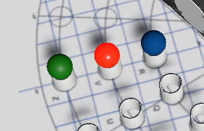
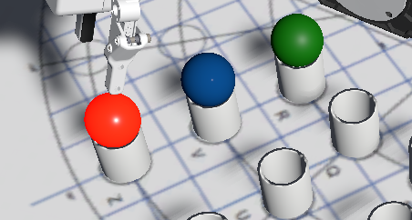

## Esercizio 2

Operazione di pick-and-place con staging area.

### Obiettivo
Spostare le palline e raggiungere la seguente disposizione:

- R green
- V blue
- Z red

Per ottenere questo risultato è consigliato fare uso di uno slot libero come "staging area" (ad esempio il cilindro U) nel quale disporre una pallina durante gli step intermedi (se necessario).

### Consegna

La consegna prevede l'invio del file Scratch contenente le istruzioni per la corretta esecuzione dell'esercizio.

