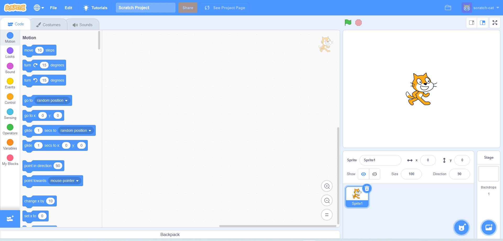

## Caricare un progetto Scratch

1. Seguire la [procedura](scratch_tutorial.md) per l'inizializzazione dell'ambiente Scratch

2. Fare click su *File* nel menù in alto a sinistra dell'ambiente di lavoro

    

3. Selezionare *Load from your computer* (a seconda della lingua impostata del sistema operativo potrebbe chiamarsi in modo leggermente diverso)

    

4. Si aprirà un dialog dal quale è possibile selezionare un file. Scegli uno sketch precedentemente salvato e premi OK.

4. Il progetto corrente verrà sovrascritto da quello salvato. A causa di un bug in alcuni casi il progetto potrebbe non venire caricato correttamente, in quei rari casi riavviare l'applicazione e riprovare.
