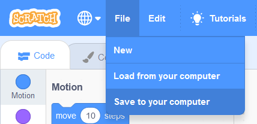
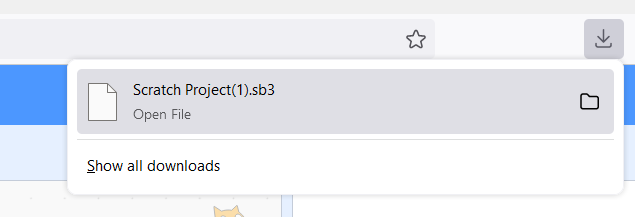

## Salvare un progetto Scratch

1. Seguire la [procedura](scratch_tutorial.md) per l'inizializzazione dell'ambiente Scratch

2. Fare click su *File* nel menù in alto a sinistra dell'ambiente di lavoro

    

3. Selezionare *Save to your computer* (a seconda della lingua impostata del sistema operativo potrebbe chiamarsi in modo leggermente diverso)

    

4. Un file di estensione *.sb3* verrà scaricato dal browser nella cartella predefinita per i Downloads. Si tratta del progetto Scratch attualmente in uso.

    

