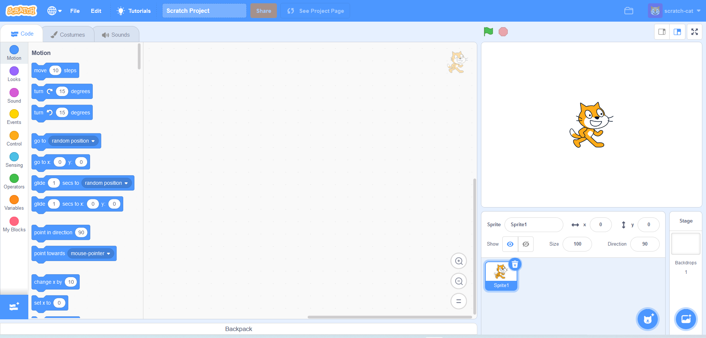
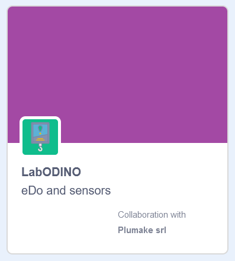
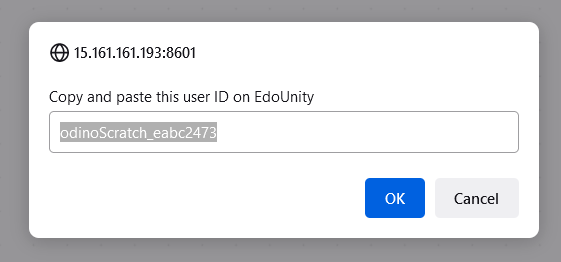
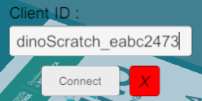
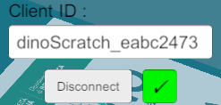
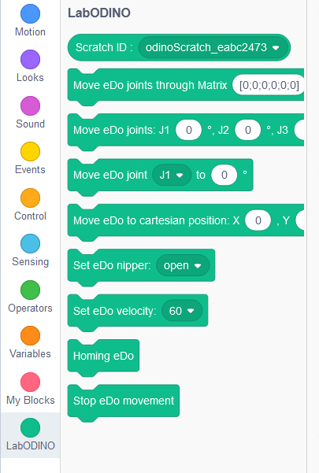

## Abilitare Scratch

Per abilitare l'ambiente di lavoro Scratch segui questi steps:

1. Nel simulatore, fai click sull'icona nera accanto al logo Scratch, questo dovrebbe aprire una nuova tab nel browser predefinito del sistema

    

    

2. Per abilitare l'estensione del simulatore, fare click sulla relativa icona in basso a sinistra

    

3. Trovare l'estensione chiamata LabODINO e fare click su di essa, dovrebbe apparire un dialog

    

4. Copiare il token e premere 'OK'

    

5. Inserire il token nell'area Client ID del simulatore e premere Connect

    
    

6. Tornando nell'ambiente di lavoro Scratch, nei blocchi disponibili è apparsa una nuova tab contenente i comandi necessari per controllare il robot e.Do in simulazione.

    

7. We're done!